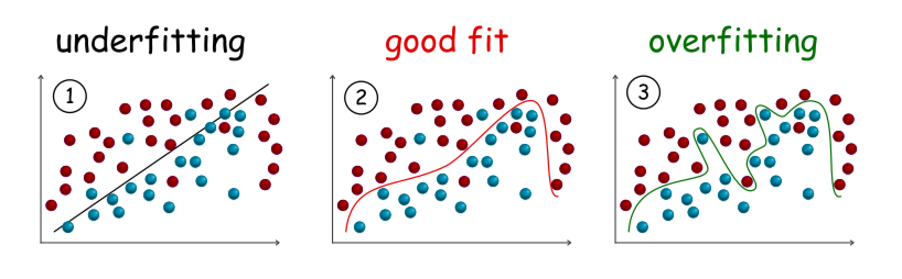
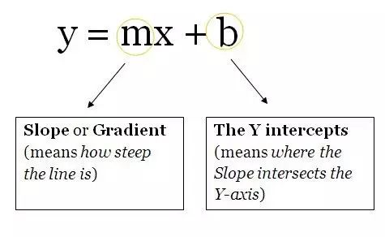
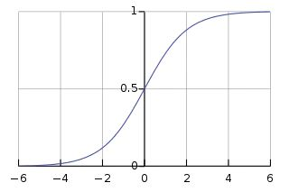
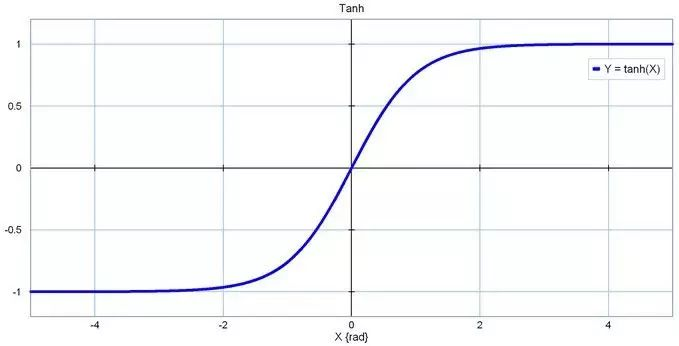
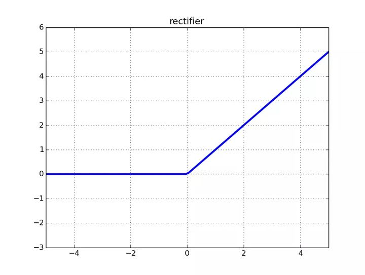
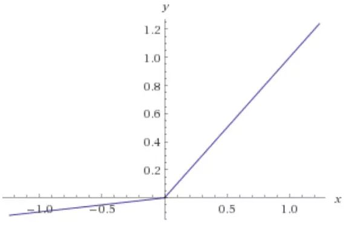
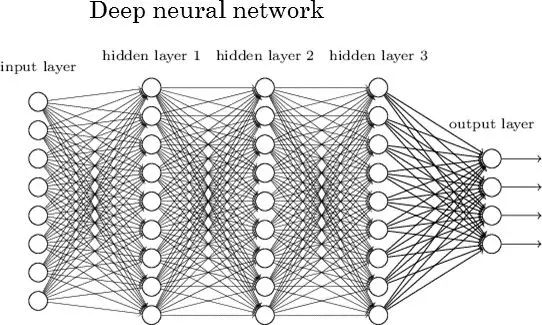
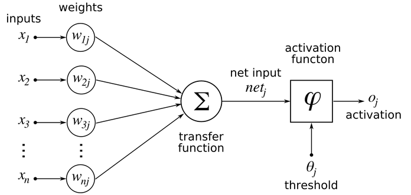
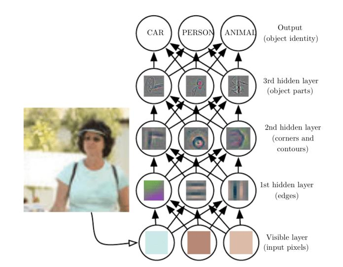
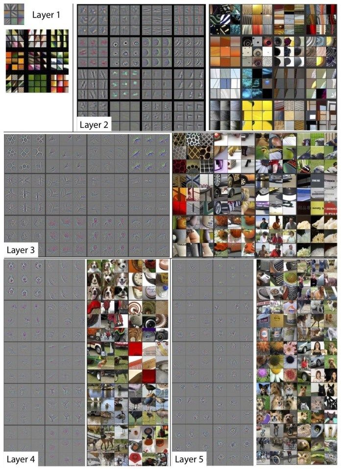

# Machine-Learning
UQ COMP

Machine learning is a branch of artificial intelligence concerned with the development & application of adaptive algorithms that use example data or previous experience to solve a given problem. Topics include: learning problems (e.g regression, classification, unsupervised, reinforcement) & theory, neural networks, statistical & probabilistic models, clustering, ensembles, implementation issues, applications (e.g. bioinformatics, cognitive science, forecasting, robotics, signal & image processing).

## Helpful learning resources
• E. Alpaydin.  Introduction to Machine Learning (third edition).  MIT Press, 2014. http://www.cmpe.boun.edu.tr/~ethem/i2ml3e/  
• C. M Bishop.  Pattern Recognition and Machine Learning. Springer. 2006  
• S. Marsland. Machine Learning: An Algorithmic Perspective (2nd edition). 2015

## Underfitting VS. Overfitting
An important measurement for supervised learning algorithms, is the **generalization**, which measures how well that a model derived from the training data can predict the desired attribute of the unseen data. When we say a model is underfitting or overfitting, it implies that the model does not generalized well to the unseen data. 

  

  

#### Underfitting  
An underfitting model is the one that does not fit well with the training data, i.e. significantly deviated from the ground truth.   
One of the causes of underfitting could be that the model is over-simplified for the data, therefore it is not capable to capture the hidden relationship within the data. As one can see from the above graph No. (1), in order to separate the samples, i.e. classification, a simple linear model (a line) is not capable to clearly draw the boundary among the samples of different categories, which results in significant misclassification.  
As a countermeasure to avoid the above cause of underfitting, one can choose an alternative algorithm that is capable to generate a more complex model from the training data set.

#### Overfitting
An overfitting model is the one that fits well with the training data, i.e. little or no error, however it does not generalized well to the unseen data.  
Contrary to the case of underfitting, an over-complicated model that is able to fit every bit of the data, would fall into the traps of noises and errors. As one can see from the above graph No. (3), the model managed to have less misclassification in the training data, yet it is more likely that it would stumble on the unseen data.  
Similarly with the underfitting case, to avoid the overfitting, one can try out another algorithm that could generate a simpler model from the training data set. Or more often, one stays with the original algorithm that generated the overfitting model, but adds a **regularization** term to the algorithm, i.e. penalizing the model that is over-complicated so that the algorithm is steered to generate a less complicated model while fitting the data.

## ANN study notes
#### 什么是神经网络？
了解神经网络的一个好方法是将它看作复合函数。你输入一些数据，它会输出一些数据。  
3 个部分组成了神经网络的的基本架构：  
- 单元/神经元  
- 连接/权重/参数  
- 偏置项  
你可以把它们看作建筑物的「砖块」。根据你希望建筑物拥有的功能来安排砖块的位置。水泥是权重。无论权重多大，如果没有足够的砖块，建筑物还是会倒塌。然而，你可以让建筑以最小的精度运行（使用最少的砖块），然后逐步构建架构来解决问题。  
我将在后面的章节中更多地讨论权重、偏置项和单元。  

#### 单元/神经元
作为神经网络架构三个部分中最不重要的部分，神经元是包含权重和偏置项的函数，等待数据传递给它们。接收数据后，它们执行一些计算，然后使用激活函数将数据限制在一个范围内（多数情况下）。  
我们将这些单元想象成一个包含权重和偏置项的盒子。盒子从两端打开。一端接收数据，另一端输出修改后的数据。数据首先进入盒子中，将权重与数据相乘，再向相乘的数据添加偏置项。这是一个单元，也可以被认为是一个函数。该函数与下面这个直线方程类似：

  

想象一下有多个直线方程，超过 2 个可以促进神经网络中的非线性。从现在开始，你将为同一个数据点（输入）计算多个输出值。这些输出值将被发送到另一个单元，然后神经网络会计算出最终输出值。  

#### 权重/参数/连接
作为神经网络最重要的部分，这些（和偏置项）是用神经网络解决问题时必须学习的数值。这就是你现在需要知道的。

#### 偏置项
这些数字代表神经网络认为其在将权重与数据相乘之后应该添加的内容。当然，它们经常出错，但神经网络随后也学习到最佳偏置项。

#### 超参数
超参数必须手动设置。如果将神经网络看作一台机器，那么改变机器行为的 nob 就是神经网络的超参数。
参考: [Genetic Algorithms + Neural Networks = Best of Both Worlds](https://towardsdatascience.com/gas-and-nns-6a41f1e8146d)

#### 激活函数
也称为映射函数（mapping function）。它们在 x 轴上输入数据，并在有限的范围内（大部分情况下）输出一个值。大多数情况下，它们被用于将单元的较大输出转换成较小的值。你选择的激活函数可以大幅提高或降低神经网络的性能。如果你喜欢，你可以为不同的单元选择不同的激活函数。  
以下是一些常见的激活函数：
- Sigmoid

  

- Tanh

  

- ReLU：修正线性单元

  

- Leaky ReLU

  

#### 层
这是神经网络在任何问题中都可获得复杂度的原因。增加层（具备单元）可增加神经网络输出的非线性。  
每个层都包含一定数量的单元。大多数情况下单元的数量完全取决于创建者。但是，对于一个简单的任务而言，层数过多会增加不必要的复杂性，且在大多数情况下会降低其准确率。反之亦然。  
每个神经网络有两层：输入层和输出层。二者之间的层称为隐藏层。下图所示的神经网络包含一个输入层（8 个单元）、一个输出层（4 个单元）和 3 个隐藏层（每层包含 9 个单元）。  

  

具有两个或更多隐藏层且每层包含大量单元的神经网络称为深度神经网络，它催生了深度学习这一新的学习领域。上图所示神经网络就是这样一个例子。  

#### 人工神经网络如何运作
人工神经网络的核心成分是人工神经元。每个神经元接收来自其他几个神经元的输入，将它们乘以分配的权重，将它们相加，然后将总和传递给一个或多个神经元。一些人工神经元可能在将输出传递给下一个变量之前将激活函数应用于输出。  

  

从本质上讲，这听起来像是一个非常琐碎的数学运算。但是，当您将成千上万的神经元多层放置并堆叠在一起时，您将获得一个人工神经网络，可以执行非常复杂的任务，例如对图像进行分类或识别语音。  
人工神经网络由一个输入层和一个输出层组成，其中输入层从外部源（数据文件，图像，硬件传感器，麦克风等）接收数据，一个或多个隐藏层处理数据，输出层提供一个或多个数据点基于网络的功能。例如，检测人，汽车和动物的神经网络将具有一个包含三个节点的输出层。对银行在安全和欺诈之间进行交易进行分类的网络将只有一个输出。    

  

#### 训练人工神经网络
人工神经网络首先为神经元之间的连接权重分配随机值。ANN正确而准确地执行其任务的关键是将这些权重调整为正确的数字。但是找到合适的权重并不是一件容易的事，特别是当您处理多层和成千上万的神经元时。  
通过对带有注释示例的网络进行“培训”来完成此校准。例如，如果您要训练上述图像分类器，则可以为其提供多张照片，每张照片均标有其相应的类别（人，汽车或动物）。当您为它提供越来越多的训练示例时，神经网络会逐渐调整其权重，以将每个输入映射到正确的输出。  
基本上，训练期间发生的事情是网络进行自我调整以从数据中收集特定模式。同样，对于图像分类器网络，当您使用质量示例训练AI模型时，每一层都会检测到特定的特征类别。例如，第一层可能检测到水平和垂直边缘，第二层可能检测到拐角和圆形。在网络的更深处，更深的层次将开始挑选出更高级的功能，例如面部和物体。  

  

当您通过训练有素的神经网络运行新图像时，调整后的神经元权重将能够提取正确的特征并准确确定图像属于哪个输出类别。  
训练神经网络的挑战之一是找到正确数量和质量的训练示例。而且，训练大型AI模型需要大量的计算资源。为了克服这一挑战，许多工程师使用“ 转移学习”（一种培训技术），您可以采用预先训练的模型，并使用针对特定领域的新示例对其进行微调。当已经有一个与您的用例接近的AI模型时，转移学习特别有效。  

# What I learned: 
- Describe the core theoretical and conceptual frameworks that are used in Machine Learning.
-	Explain the properties and functions of a range of different Machine Learning models and to be able to connect a model to appropriate theoretical foundations.
-	Formulate an algorithm that instantiates a given Machine Learning model using appropriate data.
-	Implement Machine Learning algorithms in a high-level programming language.
-	Formulate and execute experiments with implemented Machine Learning techniques on data sets, and to evaluate and reflect on the results.
-	Explain the relationships between the different types of techniques used in Machine Learning and the relationships between Machine Learning and other disciplines.
-	Recognize potential real-world applications of Machine Learning and evaluate the suitability of different Machine Learning technique implementations, algorithms, models and theory for a given application.
